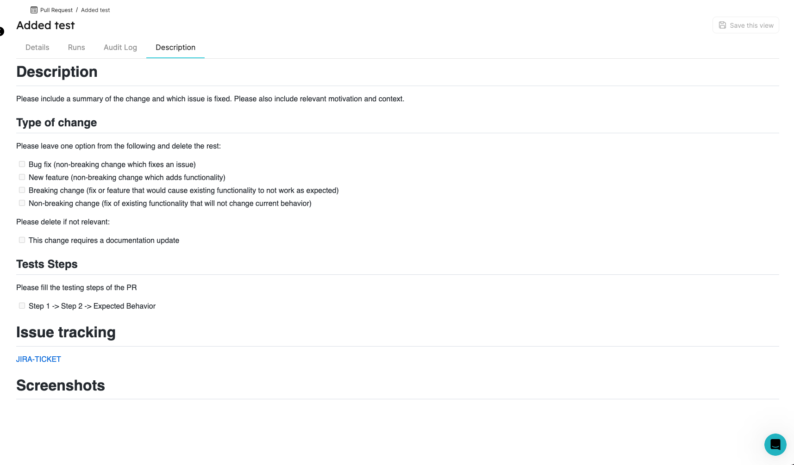

:::note Prerequisites

[Please install our Bitbucket app](./installation).
:::

# Exporting pull requests

In this tutorial, we will export pull requests from Bitbucket and create matching Port Entities!

1. Create a `pullRequest` Blueprint and `port-app-config.yml` configuration file.

To export your Bitbucket `Pull Requests` to Port, you can use the following Port Blueprints definitions, and `port-app-config.yml`:

<details>
<summary> Pull Request Blueprint </summary>

```json showLineNumbers
{
  "identifier": "pullRequest",
  "title": "Pull Request",
  "icon": "GitVersion",
  "schema": {
    "properties": {
      "creator": {
        "title": "Creator",
        "type": "string",
        "format": "user"
      },
      "assignees": {
        "title": "Assignees",
        "type": "array"
      },
      "reviewers": {
        "title": "Reviewers",
        "type": "array"
      },
      "status": {
        "title": "Status",
        "type": "string",
        "enum": ["MERGED", "OPEN", "DECLINED"],
        "enumColors": {
          "MERGED": "purple",
          "OPEN": "green",
          "DECLINED": "red"
        }
      },
      "createdAt": {
        "title": "Create At",
        "type": "string",
        "format": "date-time"
      },
      "updatedAt": {
        "title": "Updated At",
        "type": "string",
        "format": "date-time"
      },
      "description": {
        "title": "Description",
        "type": "string",
        "format": "markdown"
      },
      "link": {
        "title": "Link",
        "format": "url",
        "type": "string"
      }
    },
    "required": []
  },
  "mirrorProperties": {},
  "calculationProperties": {},
  "relations": {}
}
```

</details>

<details>

<summary> Port port-app-config.yml </summary>

```yaml showLineNumbers
resources:
  - kind: pull-request
    selector:
      query: "true" # a JQ expression that it's output (boolean) determinating wheter to report the current resource or not
    port:
      entity:
        mappings:
          identifier: ".destination.repository.name + (.id|tostring)" # The Entity identifier will be the repository name + the pull request ID. After the Entity is created, the exporter will send `PATCH` requests to update this pull request within Port.
          title: ".title"
          blueprint: '"pullRequest"'
          properties:
            creator: ".author.display_name"
            assignees: "[.participants[].user.display_name]"
            reviewers: "[.reviewers[].user.display_name]"
            status: ".state"
            createdAt: ".created_on"
            updatedAt: ".updated_on"
            description: ".description"
            link: ".links.html.href"
```

</details>

:::info

- See how to apply `port-app-config.yml` either on the repository level or globally [here](./configuration.md).
- We leverage [JQ JSON processor](https://stedolan.github.io/jq/manual/) to map and transform Bitbucket objects to Port Entities.
- Click [Here](https://support.atlassian.com/bitbucket-cloud/docs/event-payloads/#Pull-request) for the Bitbucket pull request object structure.

:::

2. push `port-app-config.yml` to your default branch.

Done! after the push is complete, the exporter will begin creating all the `open` pull requests in the repository, and update on every change to existing or creation of new `pull-requests`.

Now you can view and query all of your Pull Requests as Port Entities!


You can also see the description in markdown format inside the [Specific Entity Page](../../software-catalog/entity/entity.md#entity-page).


