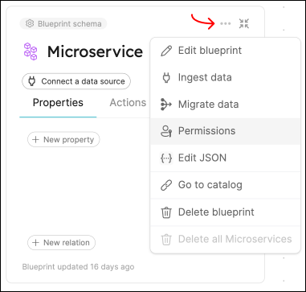

import Tabs from "@theme/Tabs"
import TabItem from "@theme/TabItem"

# Dynamic permissions

Port allows setting dynamic permissions for executing and/or approving execution of self-service actions, based on any properties/relations of an action's corresponding blueprint.

## Potential use-cases

Examples of useful applications of dynamic permissions:

- Ensure that action executions requested by a team member can only be approved by his/her direct manager.
- Perform validations/manipulations on inputs that depend on data from related entities.

## Configuring permissions

To use dynamic permissions:

- Go to your [`builder`](https://app.getport.io/dev-portal/data-model) page.
- Choose the blueprint that is coupled to the Action you want to set permissions for.
- Click on the `...` icon of the blueprint, then click on `Permissions`.



The blueprint's permission configuration in JSON format will open in a new window. Here you can define permissions for entities and actions belonging to the blueprint.

:::info Note
Currently, dynamic permissions are supported only for actions. Support for entities will be available soon 😎
:::

Look for the `"actions"` key, and under it find the name of the action you want to set permissions for.  
Each action has the following two keys under it:

- `"execute"` - any logic defined here pertains to the execution of the action. Here you can define who can run action.
- `"approve"` - any logic defined here pertains to the approval of the action. If "manual approval" is not enabled for this action, this key is irrelevant since no approval is needed.

Under each of these two keys, you can add a `policy` key, which allows you to use more complex logic using two keys:

1. ["queries"](/search-and-query/) - a collection of [rules](/search-and-query/#rules) you can use to get/filter the data you need.
2. "conditions" - an array of strings, where each string is a jq query with access to the `"queries"` data.

<details>
<summary>Example snippet (click to expand)</summary>

```json showLineNumbers
"actions": {
  "action_name": {
    "execute": {
      "policy": {
        "queries": {
          "query_name": {
            "rules": [
                # Your rule/s logic here
              ],
              "combinator": "and"
          }
        },
        "conditions": [
          # A jq query resulting in a boolean value
        ]
      }
    },
    "approve": {
      "roles": [
        "Admin"
      ],
      "users": [],
      "teams": [],
      "policy": {
        "queries": {
          "query_name": {
            "rules": [
                # Your rule/s logic here
              ],
              "combinator": "and"
          }
        },
        "conditions": [
          # A jq query resulting in an array of strings
        ]
      }
    }
  }
}
```

</details>

### Guidelines

- You can define any number of queries you wish for execution/approve policies.
- For `execution` policies, the condition must return a `boolean` value (determining whether the requester is allowed to execute the action or not).
- For `approve` policies, the condition must return an array of strings (the users who can approve the execution of the action).
- In both `rules` and `conditions` values, you can access the following metadata:
  - `blueprint` - the blueprint tied to the action.
  - `action` - the action object.
  - `userInputs` - the values provided to the action inputs by the user who executed the action.
  - `user` - the user who executed the action.
  - `entity` - the entity created/modified/deleted by this action.

## Complete example

Here is an example of a permissions JSON belonging to a simple `service` blueprint.  
In this example the `scaffold_new_microservice` action can be approved only by the team leader of the user that asked to execute the action.

Note the `scaffold_new_microservice` action (**line 49**). The `approve` key under it contains a `policy` key which indicates that some additional logic is defined here that determines who can approve an exeution of this action.

<details>
<summary>Service permissions JSON (click to expand)</summary>

```json showLineNumbers
{
  "entities": {
    "register": {
      "roles": ["microservice-moderator", "Admin"],
      "users": ["admin@dyn-permissions-demo.com"],
      "teams": [],
      "ownedByTeam": false
    },
    "update": {
      "roles": ["microservice-moderator", "Admin"],
      "users": ["admin@dyn-permissions-demo.com"],
      "teams": [],
      "ownedByTeam": false
    },
    "unregister": {
      "roles": ["microservice-moderator", "Admin"],
      "users": ["admin@dyn-permissions-demo.com"],
      "teams": [],
      "ownedByTeam": false
    },
    "updateProperties": {
      "$identifier": {
        "roles": ["microservice-moderator", "Admin"],
        "users": ["admin@dyn-permissions-demo.com"],
        "teams": [],
        "ownedByTeam": false
      },
      "$title": {
        "roles": ["microservice-moderator", "Admin"],
        "users": ["admin@dyn-permissions-demo.com"],
        "teams": [],
        "ownedByTeam": false
      },
      "$team": {
        "roles": ["microservice-moderator", "Admin"],
        "users": ["admin@dyn-permissions-demo.com"],
        "teams": [],
        "ownedByTeam": false
      },
      "$icon": {
        "roles": ["microservice-moderator", "Admin"],
        "users": ["admin@dyn-permissions-demo.com"],
        "teams": [],
        "ownedByTeam": false
      }
    }
  },
  "actions": {
    "scaffold_new_microservice": {
      "execute": {
        "roles": ["Member", "Admin"],
        "users": [],
        "teams": [],
        "ownedByTeam": false
      },
      "approve": {
        "roles": ["Admin"],
        "users": [],
        "teams": [],
        "policy": {
          "queries": {
            "executingUser": {
              "rules": [
                {
                  "value": "user",
                  "operator": "=",
                  "property": "$blueprint"
                },
                {
                  "value": "{{.trigger.user.email}}",
                  "operator": "=",
                  "property": "$identifier"
                }
              ],
              "combinator": "and"
            },
            "approvingUsers": {
              "rules": [
                {
                  "value": "user",
                  "operator": "=",
                  "property": "$blueprint"
                },
                {
                  "value": "Approver",
                  "operator": "=",
                  "property": "role"
                }
              ],
              "combinator": "and"
            }
          },
          "conditions": [
            "(.results.executingUser.entities | first | .relations.team) as $executerTeam | [.results.approvingUsers.entities[] | select(.relations.team == $executerTeam) | .identifier]"
          ]
        }
      }
    }
  }
}
```

</details>
