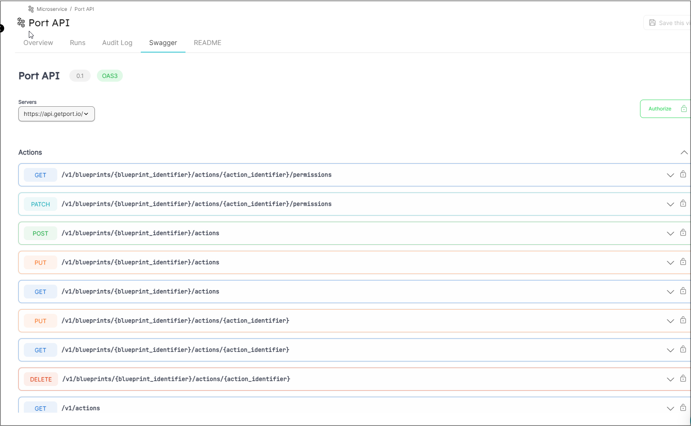

# OpenAPI

With Port, you can import and display [OpenAPI](https://www.openapis.org/) specification files as [Swagger UI](https://swagger.io/) tabs.

By using a special Open API Blueprint property, Port will display the Swagger UI matching the spec file provided in the [Specific Entity Page](../../build-your-software-catalog/sync-data-to-catalog/understand-entities-structure/understand-entities-structure.md#entity-page). In addition, it will also provide advanced functionality such as performing HTTP calls to the spec target directly from Port.

## OpenAPI property definition in Blueprint schema using URL

When using the URL format, Port will query the provided URL for the OpenAPI spec and expects a JSON OpenAPI spec

```json showLineNumbers
{
  "title": "Open API",
  "type": "string",
  "format": "url",
  "spec": "open-api",
  "description": "Open-API Prop"
}
```

:::note

When using URL for the `open-api` display please make sure that your server allows cross-origin (CORS) requests from `app.getport.io`
:::

## OpenAPI property definition in Blueprint schema using object

When using the object type, you will have to provide the full JSON OpenAPI spec as an object to the entity

```json showLineNumbers
{
  "title": "Open API",
  "type": "object",
  "spec": "open-api",
  "description": "Open-API Prop"
}
```

## Example

Here is how the Swagger tab in the Specific Entity Page appears when an OpenAPI spec is provided:


