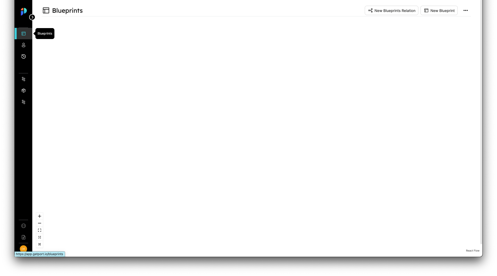
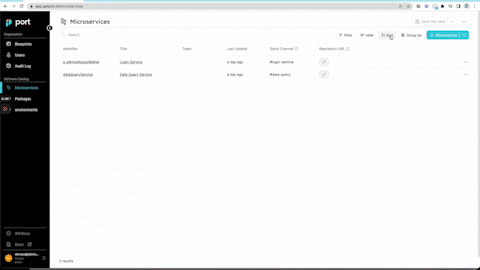
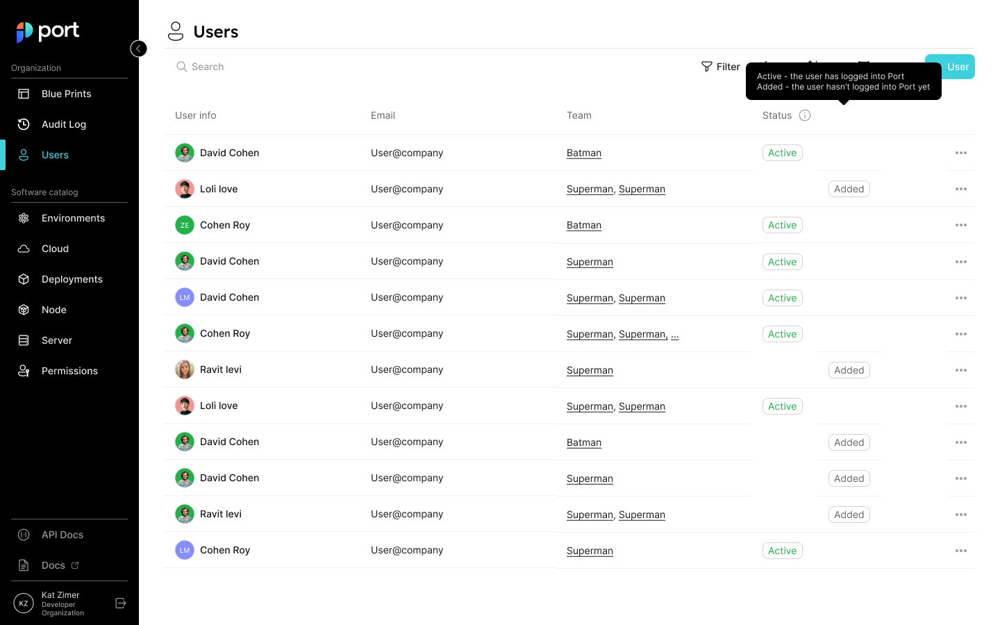

# Port Platform Overview

## What is Port

Welcome to Port! :wave:

Whether you are DevEx, Platform or DevOps engineer, Port helps you to create your customized software catalog, as part of your developer portal, in no time! and to make the life of your developers much easier with self-service capabilities.

You decide how you work and you build the perfect setup and workflows for your organizational needs.

### Port as a Builder

Our approach is to let build anything with maximum flexibility. Therefore, we went for a **builder approach**, in which you can build in Port your asset landscape the way you want it to look. We don't enforce anything on how you build your catalog.  

### We are API-first
And it is not just an empty claim.

We build Port with an **API-First approach**, meaning that our Product and API go hand in hand. This, in turn, ultimately benefits our dev velocity, but it also benefits our users directly.
It means that you can use our API to perform any operation on the Platform, while we provide you with the logic and the detailed documentation.

:::note
We Use the **OpenAPI 3** specification.  
Visit our [Swagger.](https://api.getport.io/static/index.html#/)
:::

## Main Points
- **Blueprints** are the main building blocks in Port, they represent Software & Infrastructure assets.
- **Entities** are the object instances of blueprints.
- A **Page** holds all the information you need for a specific blueprint, entity, and more.
- There are a few different ways you can make actions in Port:
  - Via the **UI**.
  - With our **API**.
- Audit Log, User management, and more are available on the Platform.

## Blueprints Page

### First, What's a Blueprint?

A **blueprint** is *the most basic* building block in Port. It represents assets that can be managed in Port, such as `microservice`, `environments`, `packages`, `clusters`, `databases`, and many more. 

Blueprints are completely customizable, and they support any number of properties the user chooses, all of which can be modified as you go. 

### Our building-space

The blueprints page is the main system page, in which you can create your full asset layout. On this page, you can create new blueprints, connect between them, edit or delete them, and set advanced operations on top of every one of them.  
When you first log in to Port, you will see an empty blueprints page.

### How to Create a Blueprint?

Creating a blueprint can be done in two ways:
- From the UI
- From the API

:::tip 
To create your first blueprint, please see our: [Quickstart Guide.](../welcome/quickstart) 
:::

## Navigation Bar

On the left side of our application, you can find the main navigation bar.

It is divided into two sections: `Organization` and `Software Catalog`.

The `Organization` section holds the following system pages:
- [Blueprints.](#first-whats-a-blueprint)
- [Users.](#the-users-page)
- [Audit Log.](#the-audit-log)

The `Software Catalog` holds all of the [pages](#main-pages).

## Pages

### How a page is created?

#### Main Pages

A new page is created whenever a new blueprint is created. The page will appear in the navigation bar on the left side, and its name will be the title of the blueprint, or the identifier name (if the title is not set).

Every blueprint's page is its main page, and it shows a full-page table view that contains the [entities](#whats-an-entity) of a specific blueprint.

#### Entity Pages

Every [Entity](#whats-an-entity) has its page, showing a summary of the entity's data and its related entities.  
An entity page will be created upon the creation of a new entity.

:::note
#### What's an entity?
An entity is the object instance of a blueprint, and it represents the data of the software components which is defined by the blueprint properties.

See [Port Components](../technical-reference/port-components/port-components) for further details.
:::

### Saved Views

Pages can also be created from any main page, by creating saved views:

## The Audit Log

In Port, we store every event in a nice visual log that shows what events have occurred on blueprints and entities: such as what entity was modified, who made the action, what type of event was it, what is the status of the action, and when was the event occurred.  

The page is divided into 2 tabs:
- Entities
- Blueprints

## The Users page

In Port, we have a dedicated page to manage all users using the system. This page shows a list of all users, including their group belonging.

### Managing Users

TBD

### Managing Teams

TBD

## Getting help

| Link | Description |
| ----------- | ----------- |
| **Product Docs** | You are here! |
| [API Docs](../technical-reference/api-reference) | Our full API docs |
| [API Swagger](https://api.getport.io/static/index.html#/) | Our Swagger host |
| [Community](https://join.slack.com/t/devex-community/shared_invite/zt-1bmf5621e-GGfuJdMPK2D8UN58qL4E_g) | Our DevEx community will help you with best practices and success stories |
| Contact Us | Directly to our Slack channel |
| Status Page | TBD |