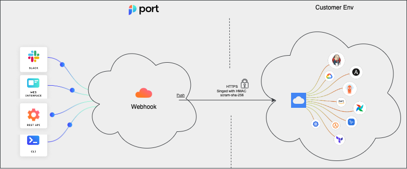

# Port Execution Webhook

Port can trigger webhook based on a customer provided custom `URL`. Both for `Action` and `Changelog` events.

The steps shown in the image above are as follows:

1. Port generates an invocation of `Action` or `Changelog` event.
2. Port signs the payload + timestamp using `HMAC` via `SHA-256` and puts it in the header.
   :::info
   In order to assure security, the listener needs to verify Port singature [Verifying Webhook Singature](../../../tutorials/self-service-actions/webhook-actions/singature-verification)
   :::
3. Port publishes an invoked `Action` or `Changelog` via a `POST` request to the given customer defined `URL`.
4. A listener implemented on the Client side receives the new `POST` request and runs code defined by the DevOps team.

:::info
The listener can be anything that can read from a Kafka topic and run code based on the received message, for example:

- AWS Lambda;
- Python code that reads from the topic;
- Docker container running code.

You control how you interact with webhooks, in the way that best suits your organization and infrastructure.
:::

An example flow would be:

1. A developer asks to deploy a new version of an existing `Microservice`;
2. The `create` action is sent to defined `URL`;
3. An AWS Lambda function is triggered by this new action message;
4. The Lambda function deploys a new version of the service;
5. When the Lambda is done, it reports back to Port about the new Microservice `Deployment`.
