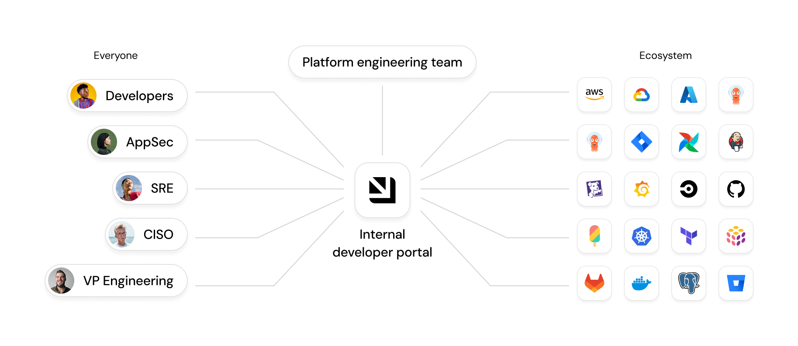

# Port Overview

## What is Port

Welcome to Port! :wave:

Internal developer portals need a context-rich software catalog with maturity and quality scorecards. They also must support comprehensive developer self-service actions. Port has it all.

### Port's product pillars

#### Software Catalog

Give developers a holistic understanding of your development lifecycle and underlying architecture. Reduce cognitive load resulting from complex architectures, tool proliferation and tribal knowledge.

[Software Catalog live demo](https://demo.getport.io/services) 🎬

#### Self-Service

Drive developer productivity by allowing developers to run free and use self-service actions like scaffolding a service or provisioning a cloud resource.

[Self Service live demo](https://demo.getport.io/self-serve) 🎬

#### Software maturity

Port checklist you define and track standards, scorecards and KPIs for quality, production readiness, productivity, and more. Drive visibility and a culture of software quality.

[Software Maturity Live Demo](https://demo.getport.io/serviceEntity?identifier=authentication&activeTab=8) 🎬

#### Workflow automation

With Port, you can set up automation to automatically respond to events from your software catalog such as TTL=0, service degradation and many more. This allows you to streamline your engineering processes, maintain a high level of performance, security, and compliance, and ensure your systems run smoothly.

[Workflow Automation Live Demo ](https://demo.getport.io/permissions) 🎬

#### R&D Insights & Reports

R&D Insights & Reports is a pillar of port that provides data-driven insights and analytical reports on the development process. It allows teams, developers and management to make informed decisions based on metrics, trends and usage patterns to improve the development process, optimize performance, and reduce cost.

[Insights & Reports live demo](https://demo.getport.io/serviceEntity?identifier=recommendation&activeTab=1) 🎬

## Quick Start

Port's [quick start](./build-your-software-catalog/build-your-software-catalog.md) takes around 5 minutes.  
By the end of it you will have a good basic understanding of how Port works.
