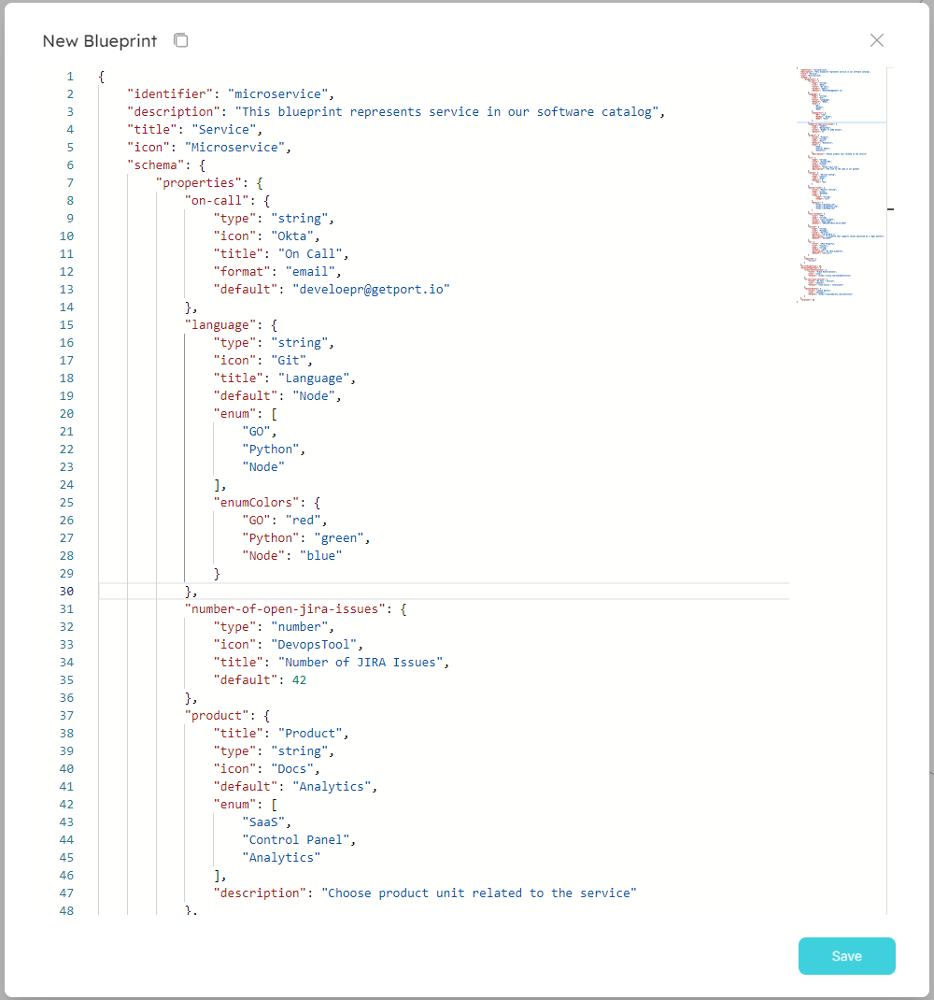
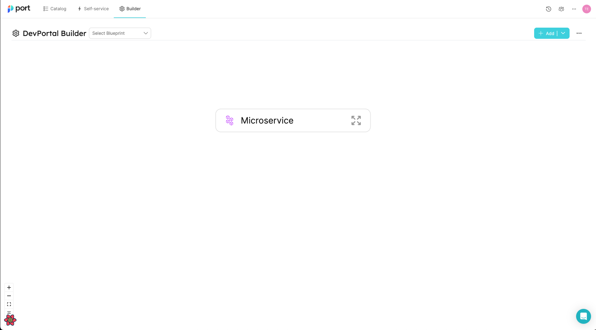
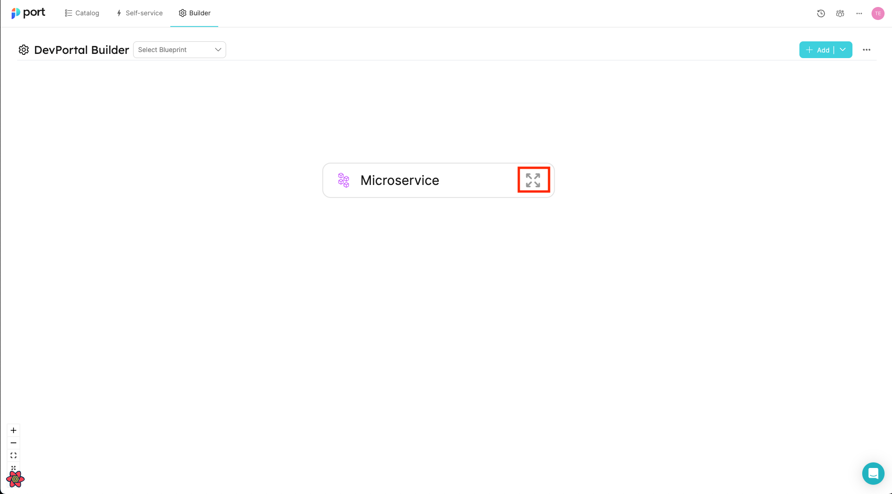

import Tabs from "@theme/Tabs"
import TabItem from "@theme/TabItem"

# Blueprint Tutorial

## Create Blueprints

### From the UI

Let's take a look at the Blueprints page. Click on **Add blueprint** at the top right hand corner, and configure a `microservice` Blueprint. as shown in the image below:


After clicking the button, you should see a creation form:



The microservice Blueprint will include the following properties:

- **Repo** - a URL to the source code repository, storing the code of the microservice.
- **Slack Channel** - the slack channel of the team responsible for that microservice.

:::note
Don't worry if you feel like the `microservice` Blueprint should include more properties, you can always go back and add or remove properties later.
:::

:::tip Available Icons
Notice that in the image above in the icon field, the value `microservice` is already filled in.

For a list of available icons refer to the [full icon list](../../software-catalog/blueprint/blueprint.md#full-icon-list).
:::

In order to create a Blueprint with the following properties, we will use the following JSON body:

```json showLineNumbers
{
  "identifier": "microservice",
  "title": "Microservice",
  "icon": "Microservice",
  "calculationProperties": {},
  "schema": {
    "properties": {
      "slackChannel": {
        "type": "string",
        "title": "Slack Channel",
        "description": "The channel of the microservice\\'s maintainers"
      },
      "repoUrl": {
        "type": "string",
        "format": "url",
        "title": "Repository URL",
        "description": "A URL to the Git repository of the microservice"
      }
    },
    "required": ["repoUrl"]
  }
}
```

Click on the `save` button and view your new Blueprint in the DevPortal Setup page:



If you click on the `expand` button as shown in the image below:



You will see an expanded view of the Blueprint we just created, with all of the properties listed alongside the types we provided for them:


### From the API

Let's see how we can use Port's API to create Blueprints:

#### Getting an API token

:::note
For the next part, you will need your Port `CLIENT_ID` and `CLIENT_SECRET`.

To find your Port API credentials go to [Port](https://app.getport.io), click on `Crednetials` at the bottom left corner and you will be able to view and copy your `CLIENT_ID` and `CLIENT_SECRET`:

<center>


</center>

:::

In order to perform any action with Port's API, you first need an **access token**. Below are some code examples from various languages:

<Tabs groupId="code-examples" defaultValue="python" values={[
{label: "Python", value: "python"},
{label: "Javascript", value: "javascript"},
{label: "cURL", value: "curl"}
]}>

<TabItem value="python">

```python showLineNumbers
# Dependencies to install:
# $ python -m pip install requests

import requests

CLIENT_ID = 'YOUR_CLIENT_ID'
CLIENT_SECRET = 'YOUR_CLIENT_SECRET'

API_URL = 'https://api.getport.io/v1'

credentials = {'clientId': CLIENT_ID, 'clientSecret': CLIENT_SECRET}

token_response = requests.post(f'{API_URL}/auth/access_token', json=credentials)

access_token = token_response.json()['accessToken']

# You can now use the value in access_token when making further requests

```

</TabItem>

<TabItem value="javascript">

```javascript showLineNumbers
// Dependencies to install:
// $ npm install axios --save

const axios = require("axios").default;

const CLIENT_ID = "YOUR_CLIENT_ID";
const CLIENT_SECRET = "YOUR_CLIENT_SECRET";

const API_URL = "https://api.getport.io/v1";

const response = await axios.post(`${API_URL}/auth/access_token`, {
  clientId: CLIENT_ID,
  clientSecret: CLIENT_SECRET,
});

const accessToken = response.data.accessToken;

// You can now use the value in accessToken when making further requests
```

</TabItem>

<TabItem value="curl">

```bash showLineNumbers
# Dependencies to install:
# For apt:
# $ sudo apt-get install jq
# For yum:
# $ sudo yum install jq

access_token=$(curl --location --request POST 'https://api.getport.io/v1/auth/access_token' \
--header 'Content-Type: application/json' \
--data-raw '{
    "clientId": "CLIENT_ID",
    "clientSecret": "CLIENT_SECRET"
}' | jq '.accessToken' | sed 's/"//g')

# The token will be available in the access_token variable
```

</TabItem>

</Tabs>

#### Creating a Blueprint

Let's create a basic `microservice` Blueprint using the API. It will include a `slack channel` and a `Repo URL`.

In order to interact with the Blueprints API our basic URL will be [https://api.getport.io/v1/blueprints](https://api.getport.io/v1/blueprints), and we will create the Blueprint using an HTTP **POST** request.

:::note
We will use the [access token](#getting-an-api-token) we generated earlier when making new requests to Port's API.

:::

<Tabs groupId="code-examples" defaultValue="python" values={[
{label: "Python", value: "python"},
{label: "Javascript", value: "javascript"},
{label: "cURL", value: "curl"}
]}>

<TabItem value="python">

```python showLineNumbers
# Dependencies to install:
# $ python -m pip install requests

# the access_token variable should already have the token from the previous example

import requests

API_URL = 'https://api.getport.io/v1'

headers = {
    'Authorization': f'Bearer {access_token}'
}

blueprint = {
    'identifier': 'microservice',
    'title': 'Microservice',
    'icon': 'Microservice',
    "calculationProperties": {},
    'schema': {
        'properties': {
            'slackChannel': {
                'type': 'string',
                'title': 'Slack Channel',
                'description': 'The channel of the microservice\'s maintainers'
            },
            'repoUrl': {
                'type': 'string',
                'format': 'url',
                'title': 'Repository URL',
                'description': 'A URL to the Git repository of the microservice'
            }
        },
        'required': ['repoUrl'],
    }
}

response = requests.post(f'{API_URL}/blueprints', json=blueprint, headers=headers)

# response.json() contains the content of the resulting blueprint

```

</TabItem>

<TabItem value="javascript">

```javascript showLineNumbers
// Dependencies to install:
// $ npm install axios --save

// the accessToken variable should already have the token from the previous example

const axios = require("axios").default;

const API_URL = "https://api.getport.io/v1";

const config = {
  headers: {
    Authorization: `Bearer ${accessToken}`,
  },
};

const blueprint = {
  identifier: "microservice",
  title: "Microservice",
  icon: "Microservice",
  calculationProperties: {},
  schema: {
    properties: {
      slackChannel: {
        type: "string",
        title: "Slack Channel",
        description: "The channel of the microservice's maintainers",
      },
      repoUrl: {
        type: "string",
        format: "url",
        title: "Repository URL",
        description: "A URL to the Git repository of the microservice",
      },
    },
    required: ["repoUrl"],
  },
};

const response = await axios.post(`${API_URL}/blueprints`, blueprint, config);

// response.data contains the content of the resulting blueprint
```

</TabItem>

<TabItem value="curl">

```bash showLineNumbers
# the access_token variable should already have the token from the previous example

curl --location --request POST "https://api.getport.io/v1/blueprints" \
	--header "Authorization: Bearer $access_token" \
	--header "Content-Type: application/json" \
	--data-raw "{
    \"identifier\": \"microservice\",
    \"title\": \"Microservice\",
    \"icon\": \"Microservice\",
    \"calculationProperties\": {},
    \"schema\": {
        \"properties\": {
            \"slackChannel\": {
                \"type\": \"string\",
                \"title\": \"Slack Channel\",
                \"description\": \"The channel of the microservice's maintainers\"
            },
            \"repoUrl\": {
                \"type\": \"string\",
                \"format\": \"url\",
                \"title\": \"Repository URL\",
                \"description\": \"A URL to the Git repository of the microservice\"
            }
        },
        \"required\": [\"repoUrl\"]
    }
}"

# The output of the command contains the content of the resulting blueprint
```

</TabItem>

</Tabs>

Now, you will have a Blueprint in the DevPortal Setup page as follows:


## Update Blueprints

You can always modify Blueprints, add/remove properties or change existing property types as necessary.

To update a Blueprint, you can do either of the following:

- In the DevPortal Setup page, click on the 3 dots (`...`) button and after it the `Properties` button;
- Make an HTTP PUT request to the URL: `https://api.getport.io/v1/{blueprint_identifier}`
  - A PUT request has the same body as a POST request, it will simply overwrite the Blueprint with the new data provided.


### Update Blueprint identifier

There are two methods to change a Blueprint's identifier:

#### From the UI

1. In the DevPortal Setup page, find the node of the desired Blueprint, click on the 3 dots (`...`) button and then click on the `Properties` button;
2. Update the value of the `identifier` key to the new identifier;
3. Click `Save`.

#### PUT request

Make an HTTP PUT request to the URL `https://api.getport.io/v1/blueprints/{old_blueprint_identifier}` with the following JSON body:

```json showLineNumbers
{
  "identifier" :"new_blueprint_identifier",
  ...ORIGINAL BLUEPRINT DEFINITION
}
```

#### PATCH request

Make an HTTP PATCH request to the URL `https://api.getport.io/v1/blueprints/{old_blueprint_identifier}` with the following JSON body:

```json showLineNumbers
{
  "identifier": "new_blueprint_identifier"
}
```

### Rename properties

In order to rename the properties, you can make an HTTP PATCH request to the URL: `https://api.getport.io/v1/{blueprint_identifier}/properties/{property_name}/rename` with this following JSON:

```jsonShowLineNumbers
{
  newPropertyName: "updatedPropertyName"
}
```

- You can also rename the CalculationProperties & MirrorProperties names by using this API.

## Delete Blueprints

:::danger
A Blueprint cannot be restored after deletion!
:::

In order to delete a Blueprint you can do either of the following:

- Click on the trash can icon in the specific Blueprint’s node in the DevPortal Setup page;
- Make an HTTP DELETE request to the URL `https://api.getport.io/v1/{blueprint_identifier}`


## Delete All Entities of A Blueprint

In order to delete all entities of a blueprint.

- Click on the blueprint action menu (3 dots on the right side of the blueprint card)
- Choose Delete All 'Blueprint Name'
- Type 'DELETE' in the opened window and click on the `Delete` button.

:::info
Notice:

- Only Admin users can perform this action.
- This action applys for blueprints with no required relations.
- This action applys for blueprints with no more then 1000 entities.
  :::

- Make an HTTP DELETE request to the URL <br/>
  `https://api.getport.io/v1/blueprints/{blueprint_identifier}/all-entities`

## Next steps

Now that we understand **Blueprints**, we can start modeling separate Entities in our infrastructure.

In the next section, we will talk about **Relations**, a connection between two Blueprints that influences the connections between Entities, to create our infrastructure map.

To prepare for the Relations section, let's create a Blueprint for a `package` to go with the `microservice` Blueprint we created earlier:

You can create the new Blueprint from the UI (using the `Add Blueprint` button in the DevPortal Setup page), or from the API. The request body of the new Blueprint will be:

```json showLineNumbers
{
  "identifier": "package",
  "title": "Package",
  "icon": "Package",
  "calculationProperties": {},
  "schema": {
    "properties": {
      "version": {
        "title": "Version",
        "type": "string",
        "default": "1.0.0"
      },
      "inHouse": {
        "title": "In House?",
        "type": "boolean"
      }
    },
    "required": []
  }
}
```

At the end of this section, your DevPortal Setup page will include the two Blueprints shown below:


