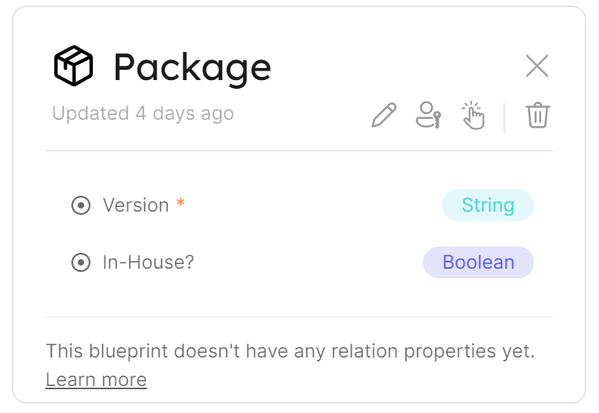
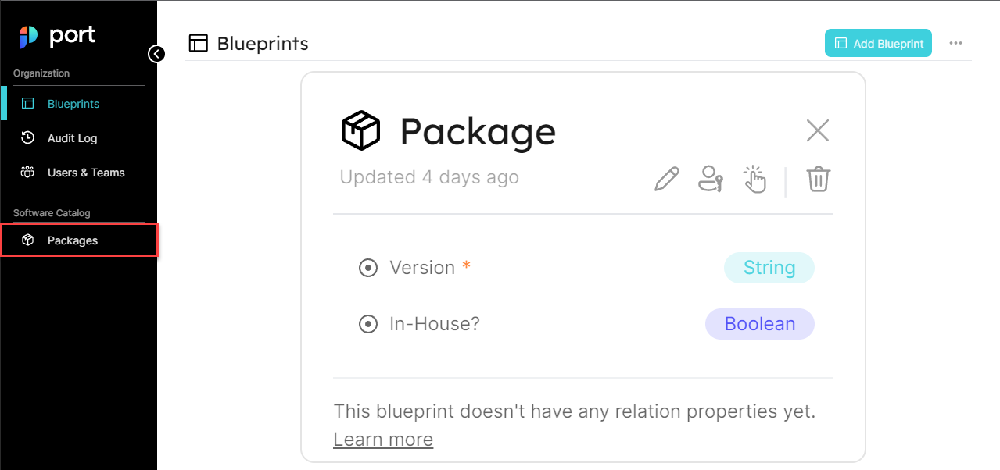
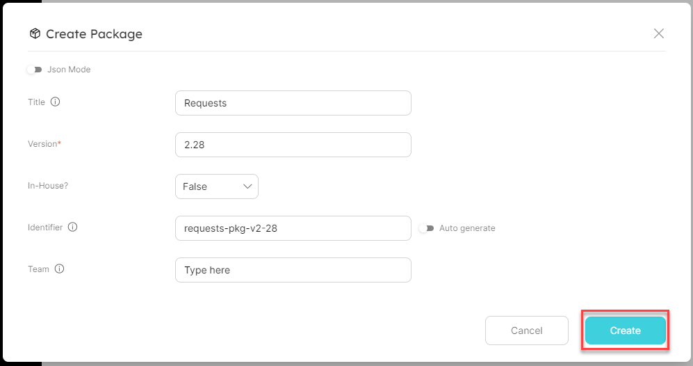
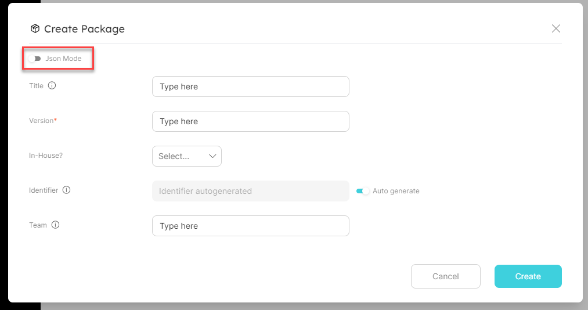
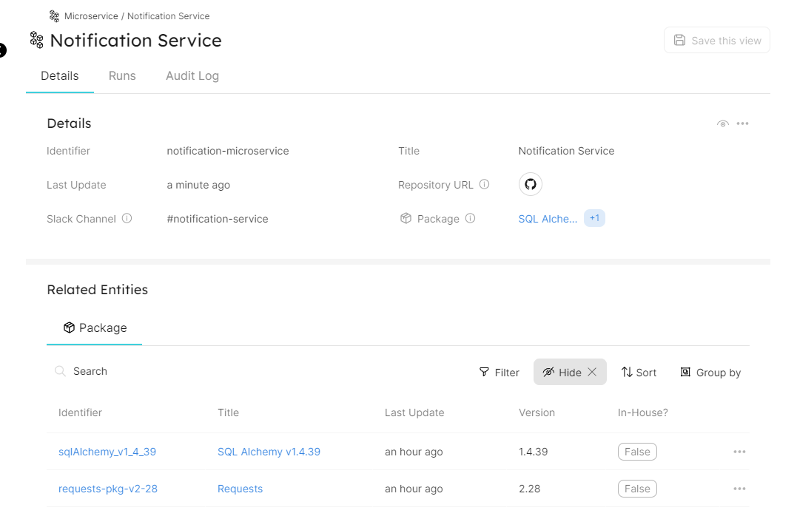

# Quickstart

## What is Port?

Port is a Developer Platform made to make life easier for developers and DevOps in an organization, by creating a single platform that acts as a single source-of-truth for all of the infrastructure assets and operations existing in the organization's tech stack.

Port then allows engineers to perform actions on these assets in a self-service fashion. From provisioning a dev environment, understanding who is the owner of a microservice, or any unique use case DevOps want to self-serve and automate.

### Port helps you to:

- Create a comprehensive **Software Catalog** by mapping all your software and infrastructure components in one place: microservices, monoliths, deployments, repos, databases, and more.
- Let your developers provision, terminate and perform day 2 operations on any asset exposed (microservice or not) in your catalog, within the policies and guardrails you’ve set, ensuring unified standards and governance over the processes inside your organization.

Port's three core building blocks are _Blueprints_, _Entities_ and _Relations_. This tutorial will walk you through your first steps on the platform and get you started on your Developer Portal journey!🚢

## Define a Blueprint

Blueprints are used to model data in Port. A Blueprint allows us to define what properties and fields an _Entity_ will contain.

Architectures and deployments vary greatly, and so do preferences and standards for data representation and asset structure. Therefore, in Port, You have full control of the way data is presented using any data format you desire, so that the Software Catalog truly represents all you need for the developer portal.

But for now, let's start with a simple example:

Your organization uses a microservice architecture; different microservices use packages to manage code reused by various microservices.

To create your Software Catalog, you need to to ingest and track your microservices, track which package (and which version) is used in which microservice, and which package is used in multiple microservices.

Let's head to [Port](https://app.getport.io/blueprints) and look at the Blueprints page, at the top right corner let's click on **Add Blueprint** and configure our first blueprint - **Package** as shown in the image below:


After clicking the button, you should see a creation form as shown below:


Our package Blueprint is going to include the following properties:

- **Version** - The package version
- **In-House** - Whether the package was developed in house or externally

In addition, the `version` field will be marked as `required`, so we can make sure that our package has a version value.

:::note
Don't worry if you want to add more properties to the Blueprint, you can always go back and edit later.
:::

In order to create a Blueprint using the properties, use the following JSON body:

```json showLineNumbers
{
  "identifier": "package",
  "title": "Package",
  "icon": "Package",
  "formulaProperties": {},
  "relations": {},
  "schema": {
    "properties": {
      "version": {
        "type": "string",
        "title": "Version",
        "description": "The version of the package"
      },
      "inHouse": {
        "type": "boolean",
        "title": "In-House?",
        "description": "Whether the package was developed in house"
      }
    },
    "required": ["version"]
  }
}
```

Click on the `save` button, and you should see your new Blueprint in the Blueprints graph:

<!--  -->

Click on the `expand` button as shown in the image below:


You should see an expanded view of the blueprint you just created, with all of its properties listed alongside the types you provided:



Congratulations! you have just created your first Blueprint! 🎉

In the next part, we will start creating Entities that match this new Blueprint, making the Software Catalog come together!

## Create your first Entities

Now that we have a Blueprint for `package`, we can add some _Entities_.

An **Entity** is an object that matches a type of a certain Blueprint. In our case, every Entity we create under the microservice Blueprint, is a microservice in our organization.

Let's create our first Entity to make things clearer.

Click on the packages page on the left sidebar:



On the packages page, click on the `+ Package` button to start creating a new Entity:


After clicking the button a new package form will appear. Let's fill it up with the following details:

```text showLineNumbers
Title: Requests
Team: - leave blank -
# For identifier, click on the "Auto generate" toggle to enter a custom identifier
Identifier: requests-pkg-v2-28
version: 2.28
inHouse: false
```

After filling all of the above, your creation page should look like this:



You can go ahead and press the `Create` button at the bottom right corner (as shown in the image above), and witness your new package appear in the packages page:


Let's repeat that process again, add another package, but this time add an entity using JSON by clicking the JSON mode button:



After clicking the button, a JSON editor will appear, similar to the one we saw in the blueprints page. Paste in the following content:

```json showLineNumbers
{
  "identifier": "sqlAlchemy_v1_4_39",
  "title": "SQL Alchemy v1.4.39",
  "properties": {
    "version": "1.4.39",
    "inHouse": false
  },
  "relations": {}
}
```

Then click on the create button at the bottom right corner.

Now you should see your 2 packages displayed in the page as shown in the image below:


Amazing! You have just created 2 awesome entities 🎉

To conclude your first steps with Port, we use Blueprints to define our data model, and Entities to store data objects that match the type of our Blueprints.

In the next part, we will look at our last building block - _Relations_. Let's get to it!

## Create a Relation

A **Relation** is a connection between two Blueprints and the Entities that are based on them. Using Relations you can create a connection graph between multiple Entities, the connection graph helps you understand the structure of your infrastructure and gain easier access to the data of related Entities.

Currently our Software Catalog only has packages, but everybody knows packages are just the building blocks for larger applications and services, so we'll now create a microservice Blueprint to represent the application that will make use of our packages. Our Microservice Blueprint will contain the following fields:

- **Repo** - A URL to the source code repository storing the microservice code;
- **Slack Channel** - A URL to the Slack Channel of the team responsible for the Microservice;
- In addition, our **Relation** will list the packages used by the microservice.

so let's go ahead and create a **Microservice Blueprint**:

- Go back to the Blueprints page;
- Click on the Add Blueprint button;
- Paste the content shown below and then click create:

```json showLineNumbers
{
  "identifier": "Microservice",
  "title": "Microservice",
  "icon": "Microservice",
  "schema": {
    "properties": {
      "repoUrl": {
        "type": "string",
        "format": "url",
        "title": "Repository URL",
        "description": "A URL to the Git repository of the microservice"
      },
      "slackChannel": {
        "type": "string",
        "title": "Slack Channel",
        "description": "The channel of the microservice\\'s maintainers"
      }
    },
    "required": []
  },
  "mirrorProperties": {},
  "formulaProperties": {},
  "relations": {}
}
```

:::tip
**Remember**, if you are having trouble at any point, you performed the exact same steps with the **Package** Blueprint in the [Define a Blueprint section](#define-a-blueprint), so feel free to go back for reference.
:::

After you're done, your blueprints page should look like this:


Now we'll create our microservice to package Relation.

### Microservice to package Relation

Our goal is to know what packages are used in each microservice, therefore you will map that Relation between the Blueprints according to the following steps:

Go to the Blueprints page, hover over the `microservice` Blueprint and click on the `pencil` icon as shown below:


In the edit form that appears, you will notice a `relations` key that is currently empty, paste the following content inside it:

```json showLineNumbers
"package": {
    "title": "Package",
    "target": "Package",
    "description": "Package(s) used by the microservice",
    "many": true,
    "required": true
}
```

Then click the `save` button at the bottom right corner.

Now your Blueprints graph should look like this:


:::note
Look at the connection graph you have just created. You modeled the relationship between your Blueprints in a way that shows which Blueprint depends on the other.
:::

Now that we have a relationship, it's time to use it to show which package is used in which microservice. To do that, you are going to create a new microservice Entity and specify the package Entities it uses:

### Mapping Packages to Microservices

You already have 2 packages Entities that you created - those are `SQL Alchemy v1.4.39` and `Requests v2.28.1`.

You are now going to create a microservice Entity and map these packages to it using the Relation you created.

The microservice Entity you are going to create is for the `notification service` of your application, here is its JSON:

```json showLineNumbers
{
  "identifier": "notification-microservice",
  "title": "Notification Service",
  "properties": {
    "repoUrl": "https://www.github.com/User/notification",
    "slackChannel": "#notification-service"
  },
  "relations": {
    "package": ["requests-pkg-v2-28", "sqlAlchemy_v1_4_39"]
  }
}
```

To create the microservice, follow these steps:

- Go to the Microservices page;
- Click the `+ Microservice` button;
- Type the values matching the JSON above (or just switch to JSON mode and paste);
- Click the create button at the bottom right corner.

:::note
If you choose to type the values manually, in order to input the packages used by the microservice, click the `expand` icon next to the `Package` field, a new JSON form with an empty array (`[]`) will appear, you can type the identifiers of the package Entities you created there, the form will also auto-complete you and only show you legal package values:


:::

Now you should see your new microservice Entity, and if you look at the package column, you will see multiple package values:


Click on the `Notification Service` link in the marked column and you will see what we call the **specific Entity page**. This page allows you to see the complete details and dependency graph of a specific entity.



:::info
In our case, the specific entity page for a microservice will also show us a tab with all of the Packages that it uses because that is the Relation we mapped.
:::

Feel free to continue exploring the specific entity page and the Packages and microservices pages. Notice the `filter`, `hide`, `sort` and `group by` controls you can find at the top right of Port's table widgets.

## What now?

Congratulations! you just modeled your first environment in Port! 🎉🚢

This quickstart was used to teach you the basic building blocks Port provides. Now, you have all the tools you need to start cataloging and tracking your environment!

You can begin creating Blueprints that describe your `services`, `applications`, `clusters` and `infrastructure resources`.

:::tip Reuse or Restart?
Remember that the blueprints, entities and relations you created here were used as a basic example, but Port always allows you to go back and edit them until they match the infrastructure you want to catalog.

And, if you want to do something completely different, you can simply delete what you created here, and start mapping out Entities exactly the way you want them to be.
:::

### Recommended next steps

:::tip
These suggestions show the basic steps in creating your very own Developer Portal, if you want to learn more about Port before starting your Developer Portal journey, look at [Diving deeper](#diving-deeper) or [Using the API](#using-the-api) below.
:::

1. Create [Blueprints](../platform-overview/port-components/blueprint.md) for your software and infrastructure components;
2. Map out the [Relations](../platform-overview/port-components/relation.md) between your Blueprints;
3. Ingest data to your catalog by creating [Entities](../platform-overview/port-components/entity.md) based on your Blueprints via Port's UI or using our API;
4. Define [Self-Service Actions](../platform-overview/port-components/../self-service-actions/self-service-actions.md) that can be used by you and your developers.

### Diving deeper

If you want to learn more about Port's capabilities in a specific area, you can check out any of these resources:

- [Blueprints deep dive](../platform-overview/port-components/blueprint.md)
- [Relations deep dive](../platform-overview/port-components/relation.md)
- [Entities deep dive](../platform-overview/port-components/entity.md)
- [Pages deep dive](../platform-overview/port-components/page.md)
- [Self-Service Actions deep dive](../platform-overview/port-components/../self-service-actions/self-service-actions.md)

### Using the API

If you want to make use of Port's REST API Interface, take a look at these resources:

- [Port API Reference](../api-reference/).
